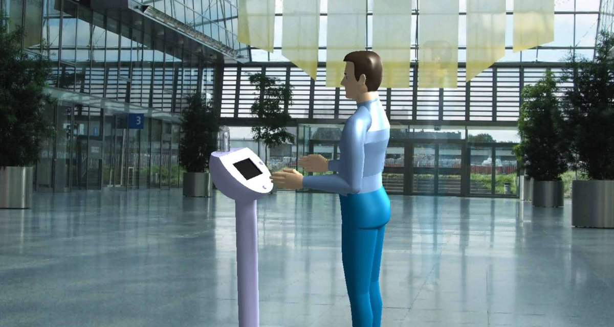

# Booth Hardware Design

If you're looking for building a booth structure to host your camera and tablet hardware, you're at the right location.

[

These files require CATIA software, and are distributed under the [CC-BY-SA 4.0 licence](https://creativecommons.org/licenses/by-sa/4.0/).
If you're making derivative works from these, you must cite the Instant Sphere team with a link to this original git repository.

Building steps for the metal structure are not provided, and building requires peculiar machines to fold the metal sheets.
As a matter of consequence, makers likely won't be able to rebuild this design easily in a fablab.

If you're making a more common DIY design to hold your hardware with more conventional methods such as laser cutting and 3D printing, make a detailed [instructable](http://instructables.com/) and open an issue here with a link to your tuto, we'll share your work to the community.

Tip: Ikea's salad bowl BLANDA BLANK has the perfect characteristics to serve as the main host box of the booth
